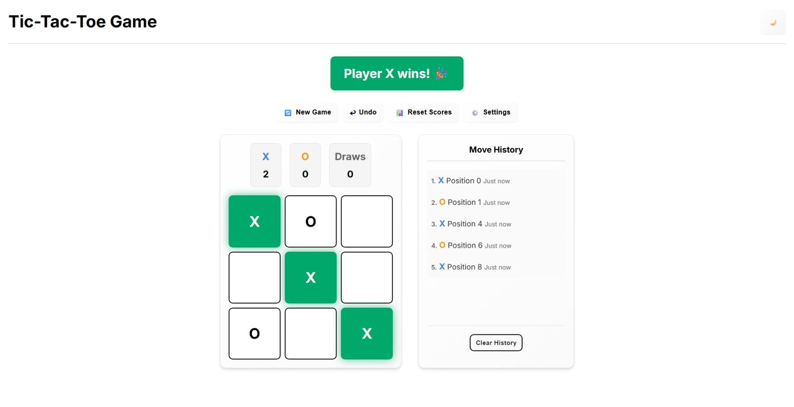
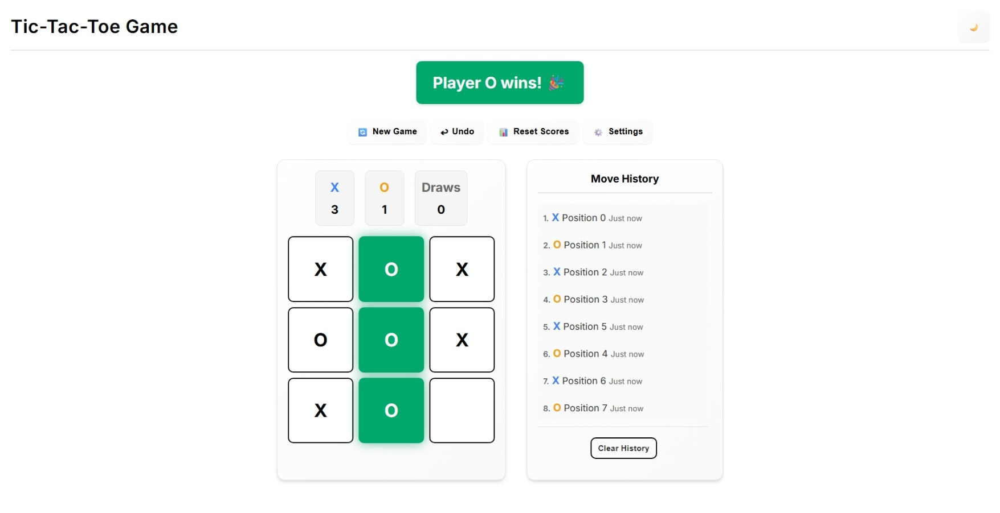
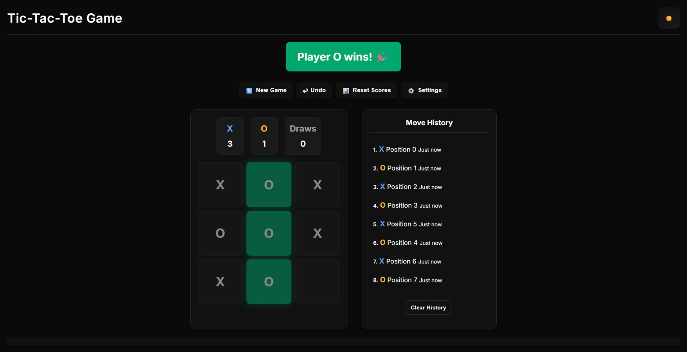

# 🎮 Tic-Tac-Toe Game

A modern, feature-rich Tic-Tac-Toe game built with TypeScript, Vite, and cutting-edge web technologies. Experience classic gameplay with contemporary design and advanced features.


*Clean, modern interface with responsive design*

## ✨ Features

### 🎯 Core Gameplay
- **Multiple Game Modes**: Human vs Human, Human vs AI
- **Smart AI Opponent**: Three difficulty levels (Easy, Medium, Hard)
- **Variable Board Sizes**: 3x3 (Classic), 4x4, and 5x5 grids
- **Undo Functionality**: Step back through your moves with one click
- **Game History**: Track all moves with timestamps and scrollable history
- **Score Tracking**: Persistent scoring across multiple games
- **Winning Highlights**: Visual celebration with elegant green highlights

### 🎨 UI/UX Excellence
- **Dual Theme Support**: Beautiful light and dark themes with smooth transitions
- **Responsive Design**: Perfect experience on desktop, tablet, and mobile devices
- **Modern Typography**: Inter font with optimized spacing and hierarchy
- **Smooth Animations**: Engaging visual feedback and micro-interactions
- **Accessibility**: Keyboard shortcuts and screen reader support
- **Custom Scrollbars**: Styled scrollbars for better visual consistency

### 🔊 Audio & Visual
- **Sound Effects**: Pleasant move sounds, win celebrations, and button clicks
- **Animation System**: Cell animations and winning line highlights
- **Visual Feedback**: Hover effects, button states, and game status indicators
- **Theme Toggle**: Instant theme switching with persistent preferences

### 🛠️ Technical Excellence
- **TypeScript**: Full type safety and enhanced developer experience
- **Modular Architecture**: Clean separation of concerns with component-based design
- **State Management**: Zustand for predictable and efficient state updates
- **Build System**: Vite for lightning-fast development and optimized production builds
- **Code Quality**: ESLint configuration for consistent code style
- **Local Storage**: Persistent settings and game preferences

## 🚀 Quick Start

### Prerequisites
- **Node.js** 18+ 
- **npm** or **yarn** package manager

### Installation

1. **Clone the repository**
   ```bash
   git clone https://github.com/your-username/tic-tac-toe-game.git
   cd tic-tac-toe-game
   ```

2. **Install dependencies**
   ```bash
   npm install
   # or
   yarn install
   ```

3. **Start development server**
   ```bash
   npm run dev
   # or
   yarn dev
   ```

4. **Open your browser**
   Navigate to `http://localhost:5173` (Vite default port)

### Build for Production

```bash
npm run build
# or
yarn build
```

The optimized production files will be generated in the `dist/` directory.

## 🎮 How to Play

### Basic Gameplay
1. **Choose Game Mode**: Click the settings button (⚙️) to select your preferred mode
2. **Select Board Size**: Choose between 3x3, 4x4, or 5x5 grids
3. **Make Moves**: Click on empty cells to place your mark (X or O)
4. **Win the Game**: Get the required number in a row (3 for 3x3, 4 for 4x4, 5 for 5x5)
5. **Track Progress**: View your scores and game history in the right panel
6. **Undo Moves**: Use the undo button (↩) to step back through your moves

### Game Controls
- **🔄 New Game**: Start a fresh game
- **↩ Undo**: Undo your last move
- **📊 Reset Scores**: Clear all score tracking
- **⚙️ Settings**: Access game configuration
- **🌙/☀️ Theme Toggle**: Switch between light and dark themes

### Keyboard Shortcuts
- `Ctrl/Cmd + R`: Start a new game
- `Ctrl/Cmd + Z`: Undo last move
- `Escape`: Close settings modal

## 📱 Screenshots

### Light Theme

*Clean, bright interface perfect for daytime gaming*

### Dark Theme

*Elegant dark interface ideal for low-light environments*

### Settings Modal
*Comprehensive settings with theme, sound, and board size options*

### Mobile Responsive
*Optimized mobile experience with touch-friendly controls*

### Game History
*Scrollable move history with timestamps and player indicators*

## 🏗️ Project Structure

```
src/
├── components/          # Reusable UI Components
│   ├── GameBoard.ts    # Interactive game board
│   ├── GameControls.ts # Control buttons and actions
│   ├── GameStatus.ts   # Status display and scoring
│   ├── SettingsModal.ts # Settings configuration
│   └── GameHistory.ts  # Move history and tracking
├── store/              # State Management
│   └── gameStore.ts    # Zustand store with persistence
├── types/              # TypeScript Definitions
│   └── game.ts         # Game type definitions
├── utils/              # Utility Functions
│   ├── gameLogic.ts    # Core game logic and rules
│   ├── aiPlayer.ts     # AI opponent algorithms
│   ├── soundManager.ts # Audio system management
│   └── animationManager.ts # Animation controls
├── styles/             # Styling and Themes
│   └── main.css        # Main stylesheet with CSS variables
└── app.ts              # Main application entry point
```

## 🛠️ Development

### Available Scripts

- `npm run dev` - Start development server with hot reload
- `npm run build` - Build optimized production bundle
- `npm run preview` - Preview production build locally
- `npm run lint` - Run ESLint for code quality checks
- `npm run type-check` - Run TypeScript type checking

### Code Style

This project uses ESLint for maintaining code quality and consistency. Run `npm run lint` to check for issues and `npm run lint --fix` to auto-fix common problems.

## 🎯 Game Modes

### Human vs Human
Classic two-player mode where players take turns on the same device. Perfect for local multiplayer fun.

### Human vs AI
Play against an intelligent AI opponent with three difficulty levels:

- **Easy**: Random moves with basic strategy - great for beginners
- **Medium**: Mix of random and strategic moves - balanced challenge
- **Hard**: Optimal play with advanced strategy - expert level difficulty

## 🎨 Customization Options

The game offers extensive customization through the settings modal:

- **Board Size**: 3x3 (Classic), 4x4, or 5x5 grids
- **Theme**: Light or Dark mode with smooth transitions
- **Sound Effects**: Toggle audio feedback for moves and wins
- **Animations**: Enable/disable visual effects and transitions
- **AI Difficulty**: Adjust opponent intelligence level

## 🔧 Technical Features

### State Management
- **Zustand Store**: Lightweight, type-safe state management
- **Persistence**: Settings and preferences saved to localStorage
- **Reactive Updates**: Automatic UI updates on state changes

### Audio System
- **Web Audio API**: Dynamic sound generation for crisp audio
- **Player-Specific Sounds**: Different tones for X and O moves
- **Volume Control**: Adjustable audio levels
- **Performance Optimized**: Efficient audio context management

### Animation System
- **CSS Animations**: Smooth transitions and micro-interactions
- **Performance Focused**: Hardware-accelerated animations
- **Accessibility**: Respects user motion preferences

### Responsive Design System
- **Mobile-First Approach**: Optimized for touch devices with progressive enhancement
- **Comprehensive Breakpoints**: 12+ device-specific breakpoints from 320px to 2560px+
- **Flexible Layout**: Adapts seamlessly to any screen size and orientation
- **Touch-Friendly**: Large touch targets (44px minimum) and intuitive gestures
- **Accessibility**: Respects user preferences for reduced motion and color schemes
- **Print Support**: Optimized print styles for game boards
- **High DPI Support**: Crisp rendering on retina and high-resolution displays

#### Device Breakpoints
- **Extra Small Mobile**: 320px - 374px (iPhone 5, small phones)
- **Small Mobile**: 375px - 413px (iPhone SE, small phones)
- **Medium Mobile**: 414px - 479px (iPhone 11, medium phones)
- **Large Mobile**: 480px - 639px (Large phones, small tablets)
- **Small Tablets**: 640px - 767px (iPad Mini, small tablets)
- **Tablets**: 768px - 1023px (iPads, tablets)
- **Large Tablets**: 1024px - 1279px (iPad Pro, large tablets)
- **Small Desktops**: 1280px - 1439px (Small laptops, desktops)
- **Medium Desktops**: 1440px - 1919px (Standard desktops)
- **Large Desktops**: 1920px - 2559px (Large monitors)
- **Ultra-wide**: 2560px+ (Ultra-wide displays)

#### Special Considerations
- **Landscape Mobile**: Optimized layout for mobile landscape orientation
- **Touch Devices**: Enhanced touch targets and gesture support
- **Reduced Motion**: Respects `prefers-reduced-motion` accessibility setting
- **Dark Mode**: Automatic dark theme based on system preferences
- **Print Styles**: Clean, printable game boards

## 🤝 Contributing

We welcome contributions! Here's how you can help:

1. **Fork the Project**
2. **Create your Feature Branch** (`git checkout -b feature/AmazingFeature`)
3. **Commit your Changes** (`git commit -m 'Add some AmazingFeature'`)
4. **Push to the Branch** (`git push origin feature/AmazingFeature`)
5. **Open a Pull Request**

### Development Guidelines
- Follow the existing code style and patterns
- Add TypeScript types for new features
- Include tests for new functionality
- Update documentation as needed

## 📝 License

This project is licensed under the MIT License - see the [LICENSE](LICENSE) file for details.

## 🙏 Acknowledgments

- **Modern Web Technologies**: Built with the latest web standards
- **Open Source Community**: Thanks to all the amazing tools and libraries
- **Design Inspiration**: Clean, modern UI principles
- **User Feedback**: Continuous improvement based on user experience

## 🔮 Future Enhancements

### Planned Features
- [ ] **Online Multiplayer**: Real-time multiplayer support
- [ ] **Tournament Mode**: Bracket-style competitions
- [ ] **Custom Themes**: Additional color schemes and styles
- [ ] **Advanced Statistics**: Detailed game analytics
- [ ] **Replay System**: Watch and share game replays
- [ ] **Custom Board Shapes**: Hexagonal and other board layouts
- [ ] **Mobile App**: Native mobile applications
- [ ] **AI Learning**: Machine learning-based AI improvements

### Enhancement Ideas
- [ ] **Sound Themes**: Different audio packs
- [ ] **Achievement System**: Unlockable rewards and badges
- [ ] **Leaderboards**: Global and local high scores
- [ ] **Game Modes**: Time-limited and challenge modes
- [ ] **Accessibility**: Enhanced screen reader support
- [ ] **Internationalization**: Multi-language support

## 📊 Performance

- **Bundle Size**: Optimized for fast loading
- **Runtime Performance**: Smooth 60fps animations
- **Memory Usage**: Efficient state management
- **Battery Life**: Optimized for mobile devices

## 🐛 Bug Reports

Found a bug? Please report it by:
1. Creating an issue with detailed steps to reproduce
2. Including your browser and device information
3. Adding screenshots if applicable

## 💡 Feature Requests

Have an idea? We'd love to hear it! Please:
1. Check existing issues first
2. Create a detailed feature request
3. Explain the use case and benefits

---

**Made with ❤️ and modern web technologies**

*Experience the perfect blend of classic gameplay and contemporary design*